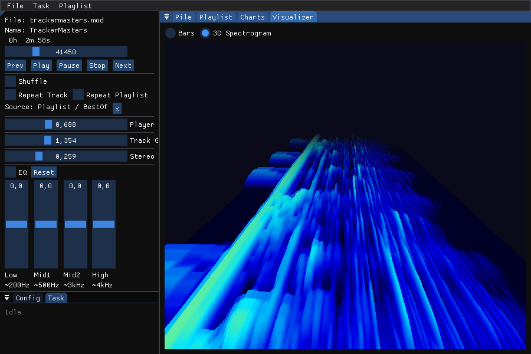

# ModPile

A tracker music organizer and player for Linux.

Collects MOD/XM/IT/S3M and related tracker module files into a local SQLite
database, plays them via libxmp and OpenAL Soft with EBU R128 loudness
normalization, and provides a Dear ImGui GUI with docking support.

## License
[GNU General Public License v2.0 or later](https://spdx.org/licenses/GPL-2.0-or-later.html)

## Screenshot


## Features

- **Library management** — import files or whole directory trees; SHA-1
  content-addressed database avoids duplicates
- **Modland integration** — browse and download from the Modland FTP archive;
  cross-reference via MD5
- **Playback** — libxmp engine, stereo 48 kHz, OpenAL Soft output, EBU R128
  loudness normalization, shuffle and loop modes
- **Super Stereo** — adjustable stereo separation via mid/side processing;
  continuously variable from mono to widened stereo
- **4-band equalizer** — low, low-mid, high-mid, and high shelf/peak filters
  with per-band gain control
- **Playlists** — static playlists with drag-and-drop ordering; dynamic
  playlists (Top Rated, Most Played)
- **Full-text search** — FTS5-powered async search across title, artist, album
  and filename fields
- **Visualizer** — real-time FFT spectrum display rendered with OpenGL 3.2:
  - *Bars* — 256-band frequency spectrum with fast-rise/slow-fall smoothing
  - *3D Spectrogram* — rolling perspective heightmap; newest frame at front,
    older frames recede to the horizon with thermal colour mapping
- **MPRIS2** — D-Bus media player interface (play/pause/seek/metadata)
- **System tray** — tray icon with basic playback controls
- **USB numpad control** — dedicate a numpad as a physical playback remote
- **Metadata analysis** — per-track loudness, duration, channel count

## Building from source

Requires CMake 3.28+ and a C++20 compiler (GCC 12+ or Clang 16+).

### CMake options

| Option                          | Default | Description                                                                       |
|---------------------------------|---------|-----------------------------------------------------------------------------------|
| `MODPILE_ENABLE_MPRIS`          | `ON`    | Enable MPRIS2 D-Bus support (requires libsystemd); set `OFF` to build without it  |
| `MODPILE_SANITIZE`              | `none`  | Enable a sanitizer: `address`, `thread`, or `undefined`                           |
| `MODPILE_IPO`                   | `OFF`   | Enable link-time optimization (IPO/LTO)                                           |
| `MODPILE_USE_SYSTEM_LIBARCHIVE` | `ON`    | Use system libarchive; set `OFF` to fetch and build from source                   |
| `MODPILE_USE_SYSTEM_LIBXMP`     | `ON`    | Use system libxmp; set `OFF` to fetch and build from source                       |
| `MODPILE_USE_SYSTEM_ZSTD`       | `ON`    | Use system zstd; set `OFF` to fetch and build from source                         |
| `MODPILE_USE_SYSTEM_SDL`        | `ON`    | Use system SDL3/SDL3\_image/SDL3\_ttf; set `OFF` to fetch and build from source   |
| `MODPILE_USE_SYSTEM_EBUR128`    | `ON`    | Use system libebur128; set `OFF` to fetch and build from source                   |
| `MODPILE_USE_SYSTEM_KISSFFT`    | `ON`    | Use system kissfft; set `OFF` to fetch and build from source                      |
| `MODPILE_USE_SYSTEM_GLM`        | `ON`    | Use system GLM; set `OFF` to fetch and build from source                          |
| `MODPILE_USE_SYSTEM_CATCH2`     | `ON`    | Use system Catch2 (requires v3); set `OFF` to fetch and build from source         |

### Debian / Ubuntu / Mint / Pop / Elementary / Zorin / Neon

```sh
sudo apt install \
    build-essential \
    cmake \
    catch2 \
    libsqlite3-dev \
    libopenal-dev \
    libcurl4-openssl-dev \
    libarchive-dev \
    libxmp-dev \
    libebur128-dev \
    libsystemd-dev \
    libzstd-dev \
    libkissfft-dev \
    libglm-dev \
    libsdl3-dev \
    libsdl3-image-dev \
    libsdl3-ttf-dev
```

```sh
cmake -B build -DCMAKE_BUILD_TYPE=RelWithDebInfo
```

```sh
cmake --build build
ctest --test-dir build
```

### Arch Linux / Manjaro / Endeavour / Garuda / Artix

Note: `libebur128` and `kissfft` are not in the official repos. Use the flags below to fetch them automatically, or install them from the AUR.

```sh
sudo pacman -S --needed \
    base-devel \
    cmake \
    catch2 \
    sqlite \
    openal \
    curl \
    libarchive \
    libxmp \
    systemd \
    zstd \
    glm \
    sdl3 \
    sdl3_image \
    sdl3_ttf
```

```sh
cmake -B build \
    -DCMAKE_BUILD_TYPE=RelWithDebInfo \
    -DMODPILE_USE_SYSTEM_EBUR128=OFF \
    -DMODPILE_USE_SYSTEM_KISSFFT=OFF
```

```sh
cmake --build build
ctest --test-dir build
```

### Fedora / RHEL / CentOS / Rocky / Alma

Note: `libebur128`, `kissfft`, `zstd`, and `catch2` (v3) are not available in the official repos. Use the flags below to fetch them automatically.

```sh
sudo dnf install \
    gcc-c++ \
    cmake \
    sqlite-devel \
    openal-soft-devel \
    libcurl-devel \
    libarchive-devel \
    libxmp-devel \
    systemd-devel \
    glm-devel \
    SDL3-devel \
    SDL3_image-devel \
    SDL3_ttf-devel
```

```sh
cmake -B build \
    -DCMAKE_BUILD_TYPE=RelWithDebInfo \
    -DMODPILE_USE_SYSTEM_EBUR128=OFF \
    -DMODPILE_USE_SYSTEM_KISSFFT=OFF \
    -DMODPILE_USE_SYSTEM_ZSTD=OFF \
    -DMODPILE_USE_SYSTEM_CATCH2=OFF
```

```sh
cmake --build build
ctest --test-dir build
```

## Installing the udev rule for the numblock

1. Find out the vendor and product id of your numblock via `lsusb`
2. If they differ from the defaults (`1a2c:2124`), update `system/10-modpile.rules` and set the matching VID/PID in `~/.config/ModPile/ModPile.cfg` under `[numblock]`
3. Install and reload the udev rule:

```sh
sudo cp ./system/10-modpile.rules /etc/udev/rules.d/10-modpile.rules
sudo udevadm control --reload-rules
sudo udevadm trigger --subsystem-match=hidraw
```

4. Replug the numblock if it was already connected when the rule was applied
